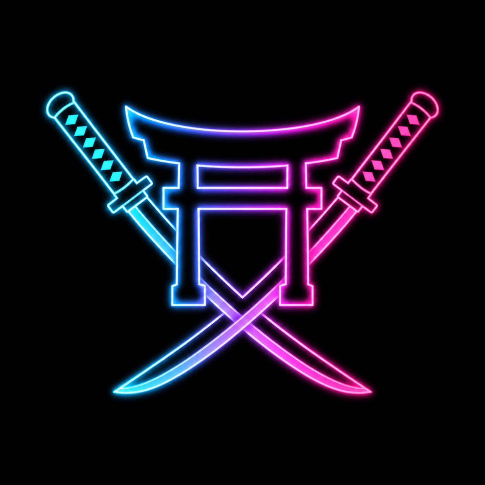

# ⚔️ NEON RONIN — Protocol Zero

Ek **full-fledged HTML5 action game** — neon cyberpunk samurai arena fighter.
Pure vanilla JS + Canvas + Web Audio. Koi build step nahi — kisi bhi static server pe chalao.



## 🎮 Play

```bash
python3 -m http.server 8000
# open http://localhost:8000
```

## 🕹 Controls

| Input | Action |
|---|---|
| `A / D` or `← →` | Move |
| `W / SPACE / ↑` | Jump (double jump in air) |
| `S / ↓` | Drop through platforms |
| `J / X` or `Left-Click` | Katana combo (3rd hit = heavy finisher) |
| `K / SHIFT` | Dash (i-frames + afterimages) |
| `L / C` or `Right-Click` | **BLADE STORM** (when energy full) |
| `P / ESC` | Pause · `M` Mute |

Touch controls auto-appear on mobile.

## 🔥 Features

- **Combat**: 3-hit katana combos, crits, lifesteal, hit-stop, screen shake, slow-mo kills
- **Enemies**: Crawler (lunge), Drone (aimed laser bolts), Wraith (teleporting assassin)
- **Boss**: `SHOGUN-9` har 5th wave — slams (floor shockwaves), bullet barrages, arena charges, 2nd-phase OVERDRIVE
- **Roguelite upgrades**: 12 upgrades (rarity-tiered cards) between waves
- **World**: parallax AI-generated cityscape, procedural mid-city, rain, lightning, flying vehicles, neon grid floor
- **Audio**: 100% synthesized — 118 BPM synthwave loop (kick/snare/hats/bass/pads/echoing arps) + 25+ SFX, no audio files
- **Juice**: dash afterimages, slash arcs, damage numbers, combo multiplier, perfect-wave bonuses, pickups with magnet
- **Meta**: localStorage high score, pause/settings/game-over screens, stats recap

## 🗂 Architecture

```
index.html          overlay DOM (menus, cards, touch)
css/style.css       neon UI
js/utils.js         math, easing, asset preloader
js/audio.js         Web Audio synth: SFX bank + music sequencer
js/input.js         keyboard / mouse / touch
js/sprites.js       pre-rendered glow sprites (no runtime shadowBlur)
js/particles.js     particles, slash arcs, floating text, rings, ghosts
js/world.js         arena, parallax city, rain, lightning, collision
js/projectiles.js   bolts, boss shockwaves, pickups
js/player.js        movement, combos, dash, blade storm, procedural ronin
js/enemies.js       Crawler / Drone / Wraith / SHOGUN-9 boss AI
js/upgrades.js      upgrade pool + rarity rolls
js/ui.js            screens + canvas HUD
js/game.js          state machine, waves, scoring, camera
js/main.js          boot + loop
assets/             AI-generated art (bg, menu key art, emblem)
```

Debug: `http://localhost:8000/#auto` runs an automated smoke test (auto-starts, fires inputs).
